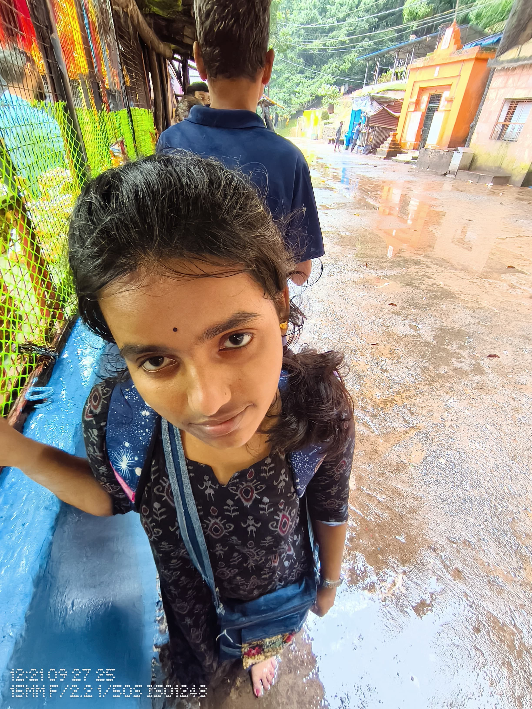

<!DOCTYPE html>
<html lang="en">
<head>
  <meta charset="UTF-8">
  <meta name="viewport" content="width=device-width, initial-scale=1.0">
  <title>Happy Birthday 💖 Sthitilragna</title>
  
</head>
<body>

  <!-- HEADER -->
  <header>
    <h1>💖 Happy Birthday, Sthitilragna 💖</h1>
  </header>

  <!-- MAIN IMAGE -->
  

  <!-- MESSAGE BOX -->
  

    
<b>To mo dhana 💋, Happy Birthday💋!</b>

    
Thank you for being my partner, my best friend, and my greatest adventure.  
       I cherish every moment we've shared and I'm so excited for all the ones to come.  
       God bless you always 💖

  

  <!-- FUNNY IMAGES -->
  
  

  <!-- FOOTER -->
  

    
With love, always 💞 — Yours, Sachin 💫

  

  <!-- CONFETTI EFFECT -->
  

  

</body>
</html>
